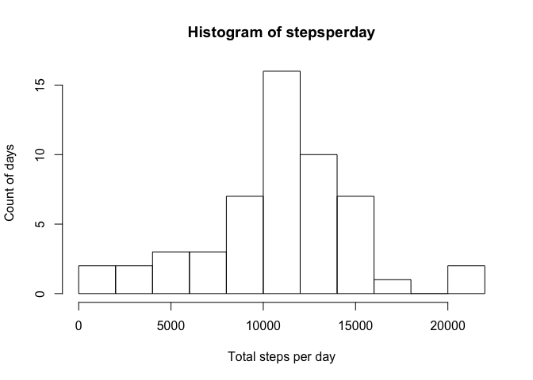
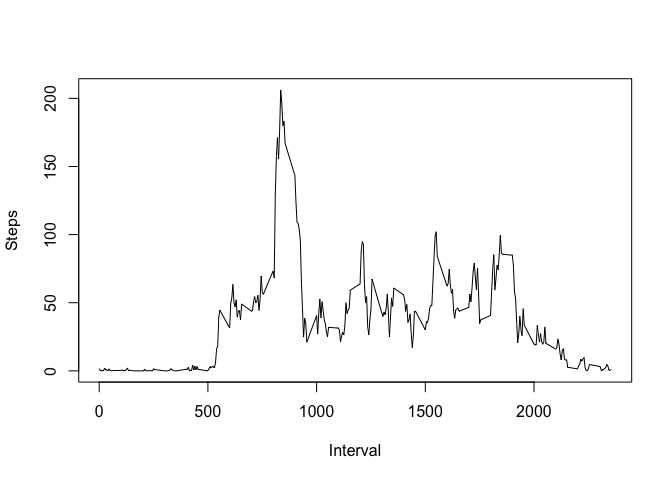
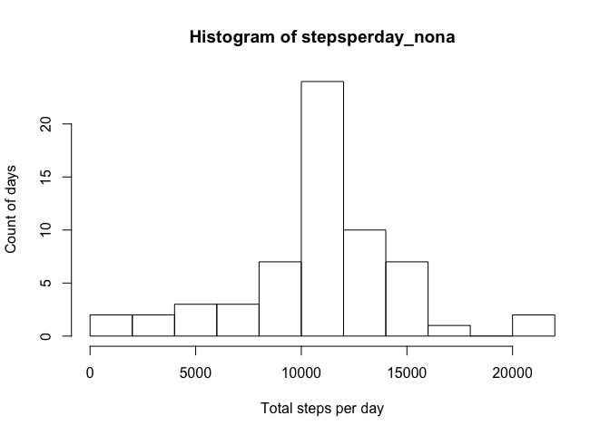
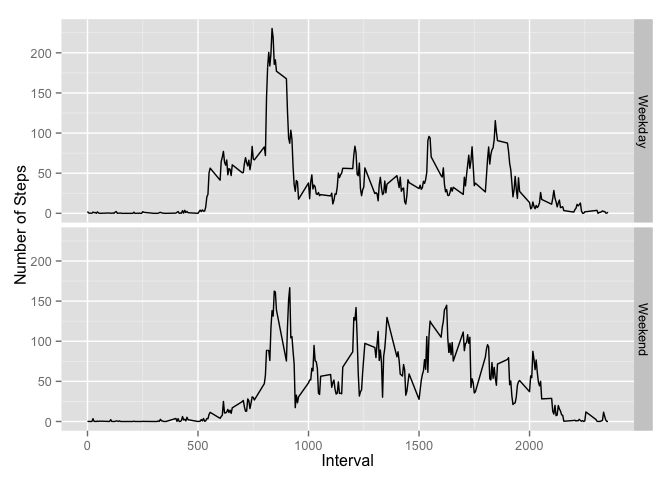

# Reproducible Research: Peer Assessment 1

## Loading and preprocessing the data
Read the unzipped data file from "activity.zip" as a data frame in activity

```r
activity <- read.csv(unz("activity.zip", "activity.csv"))
```

## What is mean total number of steps taken per day?
1. The missing values are removed 
2. Total steps per day are calculated and store in "stepsperday"
3. A histogram is generated with 10 breaks

```r
activity_no_na <- activity[!is.na(activity$steps),]
stepsperday <- tapply(activity_no_na$steps, activity_no_na$date, sum, na.rm = TRUE)
hist(stepsperday, breaks = 10, xlab = "Total steps per day", ylab = "Count of days")
```

 

```r
mean(stepsperday, na.rm = TRUE)
```

```
## [1] 10766.19
```

```r
median(stepsperday, na.rm = TRUE)
```

```
## [1] 10765
```

## What is the average daily activity pattern?
1. The missing values are removed
2. Average steps per interval are calculated and store in “stepsperint”
3. A plot is generated and the interval with highest steps is returned and printed.

```r
activity_no_na <- activity[!is.na(activity$steps),]
stepsperint <- aggregate(steps ~ interval, data = activity_no_na, mean)
plot(stepsperint,  type = "l", xlab = "Interval", ylab = "Steps")
```

 

```r
hi_int <- stepsperint$interval[match(max(stepsperint$steps),stepsperint$steps)]
sprintf("The 5-min interval that has the highest steps is %d", hi_int)
```

```
## [1] "The 5-min interval that has the highest steps is 835"
```

## Imputing missing values
1. Calculate and report the total number of missing values in the dataset (i.e. the total number of rows with NAs)

```r
total_na <- sum(is.na(activity$steps))
sprintf("The total number of missing values in the dataset is %d", total_na)
```

```
## [1] "The total number of missing values in the dataset is 2304"
```
2. Devise a strategy for filling in all of the missing values in the dataset. The strategy does not need to be sophisticated. For example, you could use the mean/median for that day, or the mean for that 5-minute interval, etc.
The strategy here is to use the mean for that 5-minute interval across all days to fill in missing values. The per interval mean obtained in the last question stored in stepsperint is obtained and used here to fill in missing values.

```r
for(i in 1:nrow(activity)){
  if (is.na(activity$steps[i])){
     activity$steps[i] <- 
         stepsperint$steps[match(activity$interval[i],stepsperint$interval)]
  }
}
stepsperday_nona <- tapply(activity$steps, activity$date, sum)
hist(stepsperday_nona, breaks = 10, xlab = "Total steps per day", ylab = "Count of days")
```

 

```r
mean(stepsperday_nona)
```

```
## [1] 10766.19
```

```r
median(stepsperday_nona)
```

```
## [1] 10766.19
```
The results show that there are no difference in the mean between this and the data obtained before filling in the missing values. This is because: 1. we removed NAs from the original data to generate the first histogram; 2. we used mean for that 5-minute interval from valid data to fill out the NAs so that the mean is not changed.
The median, however, does change because the values for the original missing days all equal to the mean of the data, making the median the same as the mean.


## Are there differences in activity patterns between weekdays and weekends?
A new column is first added to the dataset indicating the weekday/weekend status of the row. The data are then summarized based on the interval and weekday status. A 2x1 plot is then generated to indicate the average steps at different time of the day, for weekdays and weekends, respectively.

```r
library(ggplot2)
activity$weekday <- as.factor(ifelse(weekdays(as.Date(activity$date)) %in%
                                         c("Saturday","Sunday"), "Weekend", "Weekday")) 
stepsmean <- aggregate(steps ~ interval + weekday, data = activity, mean)
qplot(x = interval, y = steps, data = stepsmean, facets = weekday ~ ., geom = "line",
      xlab ="Interval", ylab = "Number of Steps")
```

 

From the figures, we can tell that there are differences in the patterns of weekdays and weekends. For example:
1. the initial increase appears earlier in weekdays;
2. the peak around interval 800-900 is larger in weekdays;
3. the activity in between interval 1000-2000 is higher in weekends;
4. the active status (steps > 50) lasts later in weekends.
